<div align="center">
  
</div>

<p align="center">
  
</p>

<p align="center">
  <a href="https://github.com/numbpun?tab=repositories">
    
  </a>
  <a href="https://github.com/numbpun/db_scratch">
    
  </a>
  <a href="https://github.com/numbpun/NanoPitch-ClassLeaderboard">
    
  </a>
</p>


### System profile

```ts
const uddhav = {
  school: "Drexel University",
  location: "Philadelphia",
  signal: "systems student",
  focus: ["database internals", "systems programming", "real-time audio ML"],
  building: ["db_scratch", "NanoPitch leaderboard", "agentic tooling"],
  learning: ["Go", "storage engines", "model deployment", "clean product surfaces"],
  tools: ["Python", "Go", "TypeScript", "JavaScript", "Git", "Linux"],
};
```

<p align="center">
  
  
  
  
  
  
  
</p>


### Featured work

| Project | What it shows |
| --- | --- |
| [db_scratch](https://github.com/numbpun/db_scratch) | Building a database from scratch to understand storage, execution, and the tradeoffs below familiar abstractions. |
| [go_learn](https://github.com/numbpun/go_learn) | Learning Go through tests and small experiments, with a systems-programming mindset. |
| [NanoPitch-ClassLeaderboard](https://github.com/numbpun/NanoPitch-ClassLeaderboard) | Real-time pitch tracking, browser-facing ML, evaluation metrics, and a class leaderboard workflow. |
| [personal-ai-assistant](https://github.com/numbpun/personal-ai-assistant) | A multi-agent assistant experiment for routing email, calendar, Notion, Slack, and research work. |
| [AgenticMentor](https://github.com/numbpun/AgenticMentor) | Early agentic tooling and mentor-style workflow experiments. |
| [Email-Stegano](https://github.com/numbpun/Email-Stegano) | A Python CLI for hiding and recovering messages in email-style text. |
| [Snakes-and-Beats](https://github.com/numbpun/Snakes-and-Beats) | A playful AI Studio experiment with interactive product energy. |
| [cs375-cardwise](https://github.com/numbpun/cs375-cardwise) | TypeScript web app practice with product thinking and course-project constraints. |

### Current focus

| Track | What I am pushing on |
| --- | --- |
| Systems programming | Database internals, Go, execution models, and learning how reliable software is shaped underneath the interface. |
| Audio and ML | Real-time model behavior, pitch detection, leaderboard evaluation, and browser-deployable ML. |
| Agentic tooling | Assistants that connect to real tools, route work intentionally, and stay understandable to the person using them. |


### GitHub signal

<p align="center">
  
  
</p>

<div align="center">

`building from first principles`

</div>
