<div align="center">
  
</div>

<div align="center">

`systems student` · `Drexel CS` · `Philadelphia` · `building by debugging`

</div>

<p align="center">
  <a href="https://github.com/numbpun?tab=repositories">
    
  </a>
  <a href="https://github.com/numbpun/db_scratch">
    
  </a>
  <a href="https://github.com/numbpun/go_learn">
    
  </a>
</p>


### About

```ts
const uddhav = {
  school: "Drexel University",
  mode: "systems student",
  interests: ["databases", "Go", "debugging", "developer tools", "audio experiments"],
  currently: ["building db_scratch", "learning Go by testing", "making rough ideas runnable"],
  style: "minimal, retro, black terminal, neon edges",
};
```

<p align="center">
  
  
  
  
  
  
</p>


### Repositories

| Signal | Repository | Why it matters |
| --- | --- | --- |
| Storage engine | [db_scratch](https://github.com/numbpun/db_scratch) | Building a database from scratch to learn what happens below SQL-shaped abstractions. |
| Language reps | [go_learn](https://github.com/numbpun/go_learn) | Small Go tests and exercises, focused on learning the language by forcing it to prove behavior. |
| Audio systems | [NanoPitch-ClassLeaderboard](https://github.com/numbpun/NanoPitch-ClassLeaderboard) | Pitch tracking, browser-facing model behavior, evaluation metrics, and leaderboard workflow. |
| Text tools | [Email-Stegano](https://github.com/numbpun/Email-Stegano) | A Python CLI for hiding and recovering messages in email-style text. |
| Web product | [cs375-cardwise](https://github.com/numbpun/cs375-cardwise) | TypeScript course project with product constraints and front-end practice. |
| Browser experiment | [Snakes-and-Beats](https://github.com/numbpun/Snakes-and-Beats) | Interactive app experiment with a playful input/output loop. |

### Build log

| Now | Next |
| --- | --- |
| Working through database internals | Make the storage/query path easier to read and test |
| Learning Go with small proofs | Turn practice into clearer examples |
| Cleaning up project READMEs | Make each repo easier to open, run, and judge quickly |


### Commit trace

<p align="center">
  
</p>

<p align="center">
  
  
</p>

<p align="center">
  
</p>

<div align="center">

`if it breaks, trace it`

</div>
